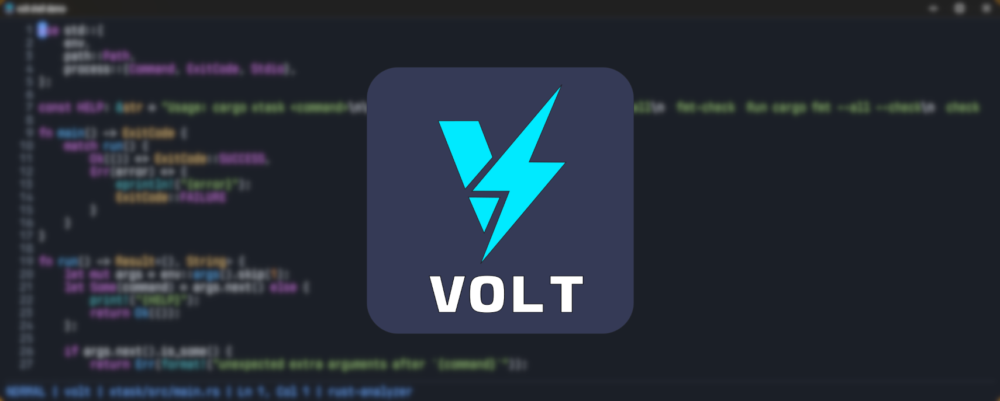

> [!WARNING]
> Volt is in early development and issues are to be expected. Please feel free to report bugs and issues in the Issues section.

  
  
  
  
  

---

`volt` is a greenfield native text editor project built in Rust. The long-term direction is an Emacs-inspired, 4coder-style editor with a Rust core, a compiled `user` extension library, and native rendering.

---
## Workspace layout

- `crates/volt` - process entry point and startup bootstrap for the `volt` executable
- `crates/editor-core` - shared runtime and editor domain concepts
- `crates/editor-buffer` - text storage and editing engine
- `crates/editor-render` - rendering abstractions and viewport drawing
- `crates/editor-sdl` - SDL3 platform and windowing integration
- `crates/editor-theme` - theme token registry and palette resolution
- `crates/editor-syntax` - tree-sitter orchestration
- `crates/editor-jobs` - async jobs and compilation runners
- `crates/editor-terminal` - builtin terminal buffers
- `crates/editor-lsp` - language server integration
- `crates/editor-dap` - debug adapter integration
- `crates/editor-git` - magit-style git workflows
- `crates/editor-fs` - workspace file system services
- `crates/editor-picker` - fuzzy picker and list UI abstractions
- `crates/editor-plugin-api` - extension API shared with the user library
- `crates/editor-plugin-host` - plugin hosting and loading services
- `user` - compiled user extension library and packages
- `xtask` - developer automation commands

## Developer commands

- `cargo xtask fmt` - format the workspace
- `cargo xtask fmt-check` - verify formatting in CI
- `cargo xtask check` - run `cargo check --workspace`
- `cargo xtask clippy` - run clippy with warnings denied
- `cargo xtask test` - run workspace tests
- `cargo xtask ci` - run formatting, check, clippy, and tests

## Current status

The repository now has a validated multi-crate foundation that covers the major architecture slices requested for the editor:

- a Cargo workspace with `xtask` automation and CI wiring
- an `editor-core` runtime with the `Window -> Workspace -> Pane/Popup -> Buffer` model
- service, command, hook, and keymap registries
- an `abi_stable`-shaped compiled `user` library with auto-loaded packages
- an SDL3 shell demo using SDL_ttf (FreeType-backed) with split panes, auto-loaded `user/*` packages, Vim-style defaults, searchable pickers, user-defined statusline segments, workspace management, and the current SDL canvas renderer
- a rope-backed `editor-buffer` engine with cursor movement, range edits, undo/redo, streaming file reads, and large-buffer coverage
- an `editor-picker` fuzzy list engine used by the command palette flow
- `editor-jobs` and `editor-terminal` foundations for async command execution, compile-style runs, and terminal transcripts
- `editor-lsp` and `editor-dap` registries for Rust server/adapter session plans
- an `editor-syntax` registry with tree-sitter language registration and Rust capture-to-theme-token mappings from `user/lang/rust.rs`
- an `editor-theme` registry with themes loaded from `user/themes/*.toml`
- `editor-fs` and `editor-git` models for oil-style directory buffers and magit-style status parsing
- the SDL shell prefers a system-installed Berkeley Mono Nerd Font when present, with cross-platform monospace fallbacks otherwise

You can run the current shell and bootstrap demos with:

`cargo run -p volt`

`cargo run -p volt -- --shell-demo`

`cargo run -p volt -- --shell-hidden`

`cargo run -p volt -- --profile-typing`

`cargo run -p volt -- --bootstrap-demo`

The default launch path opens the visible SDL3 shell on the stable SDL canvas path. The hidden smoke-test path prints the selected backend/renderer so you can verify shell startup. `--profile-typing` keeps per-frame input timing samples in memory and writes a typing profile log on exit so you can inspect which stages are slow while typing. The bootstrap demo prints a startup summary showing the currently wired picker, job, terminal, LSP, DAP, theme, directory, git, and syntax subsystems.

Inside the SDL shell, the default user package wiring now gives you:

- Vim-style normal/insert mode controls from `user/vim.rs`
- `:` and `F3` for the command picker
- `F4` for the buffer picker
- `F5` to toggle the docked popup window
- `F6` for a searchable keybinding picker
- `F7` for the theme picker
- `Ctrl-n`, `Ctrl-p`, and `Enter` to navigate and run picker entries
- a per-buffer statusline composed from `user/statusline.rs`
- `workspace.new`, `workspace.switch`, `workspace.delete`, and `workspace.list-files` commands backed by `user/workspace.rs`

Theme files live under `user/themes/*.toml` and support UI options like font, font size, and
cursor/picker roundness.
