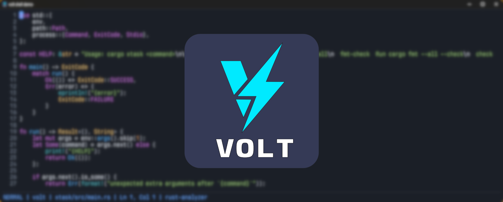

> [!WARNING]
> Volt is in early development and issues are to be expected. Please feel free to report bugs and issues in the Issues section.



<p align="center">
  <a href="https://github.com/samwdp/volt/releases"></a>
  <a href="https://github.com/samwdp/volt/stargazers"></a>
  
  
  <a href="https://github.com/samwdp/volt/actions"></a>
  <a href="https://github.com/samwdp/volt/actions"></a>
</p>

---

`volt` is a greenfield native text editor project built in Rust. The long-term direction is an Emacs-inspired, 4coder-style editor with a Rust core, a compiled `user` extension library, and native rendering.

---

## Workspace layout

- `crates/volt` - process entry point and startup bootstrap for the `volt` executable
- `crates/editor-core` - shared runtime and editor domain concepts
- `crates/editor-buffer` - text storage and editing engine
- `crates/editor-render` - rendering abstractions and viewport drawing
- `crates/editor-sdl` - SDL3 platform and windowing integration
- `crates/editor-theme` - theme token registry and palette resolution
- `crates/editor-syntax` - tree-sitter orchestration
- `crates/editor-jobs` - async jobs and compilation runners
- `crates/editor-terminal` - builtin terminal buffers
- `crates/editor-lsp` - language server integration
- `crates/editor-dap` - debug adapter integration
- `crates/editor-git` - magit-style git workflows
- `crates/editor-fs` - workspace file system services
- `crates/editor-picker` - fuzzy picker and list UI abstractions
- `user/sdk` - the only stable ABI crate shared between the host and the compiled user library
- `crates/editor-plugin-host` - plugin hosting and loading services
- `user` - compiled user extension library and packages
- `xtask` - developer automation commands
- `docs/` - static documentation site (`docs/index.html`) covering architecture, plugins, runtime YAML config, and language setup

## Developer commands

- `cargo xtask fmt` - format the workspace
- `cargo xtask fmt-check` - verify formatting in CI
- `cargo xtask check` - run `cargo check --workspace`
- `cargo xtask clippy` - run clippy with warnings denied
- `cargo xtask test` - run workspace tests
- `cargo xtask ci` - run formatting, check, clippy, and tests

## Building locally

### Build the Volt application

To build the editor binary in debug mode:

```bash
cargo build -p volt
```

For a release build:

```bash
cargo build -p volt --release
```

The executable is written to `target/debug/volt` or `target/release/volt`
(`volt.exe` on Windows).

### Build the user shared library

The compiled user customization layer lives in the `volt-user` crate and is built as both
an `rlib` and a shared library.

To build it in debug mode:

```bash
cargo build -p volt-user
```

For a release build:

```bash
cargo build -p volt-user --release
```

The shared library is written next to the `volt` binary:

- Linux: `target/<profile>/libuser.so`
- macOS: `target/<profile>/libuser.dylib`
- Windows: `target/<profile>/user.dll`

### Build both at the same time

```bash
cargo build -p volt -p volt-user
```

For a release build:

```bash
cargo build -p volt -p volt-user --release
```

### Build the packaged local distribution

To build the local bundle layout used by releases, build both crates together:

```bash
cargo build -p volt -p volt-user --release
```

After that, `target/release/` contains:

- `volt` / `volt.exe`
- the compiled user shared library
- `assets/`
- a copied `user/` tree that can be rebuilt standalone

The `volt` binary now prefers the shared library that lives next to the executable, so the
release-style rebuild workflow is:

1. build `volt` and `volt-user`
2. edit files under `user/`
3. rebuild just the user library with `cargo build -p volt-user --release`
4. replace the shared library next to `volt`

If you want to rebuild the copied standalone user tree that was staged into the release folder,
you can also run:

```bash
cd target/release/user
cargo build --release -p volt-user
```

You can also point the binary at a specific user library with `VOLT_USER_LIBRARY=/path/to/libuser.so`
(or the platform equivalent file name).

### Linux native dependencies

On Linux, building the SDL/browser-enabled application requires the GTK/WebKit development
packages used in CI. If you hit `pkg-config` errors for `glib-2.0`, `gtk`, or `webkit2gtk`,
install the same packages as the release workflow, for example:

```bash
sudo apt-get install -y pkg-config libgtk-3-dev libwebkit2gtk-4.1-dev
```

For a fully pinned Linux/WSL2 toolchain (Rust + SDL build deps + WebKit), prefer the Nix
flake below instead of installing apt packages by hand.

### Nix flake (Linux / WSL2)

`flake.nix` provides a reproducible development shell for Linux and WSL2. It installs:

- Rust stable `>= 1.91` (edition 2024) via [oxalica/rust-overlay](https://github.com/oxalica/rust-overlay), with `clippy`, `rustfmt`, `rust-src`, and `rust-analyzer`
- Native deps matching CI: cmake/ninja, X11/Wayland/GL, ALSA/Pulse, FreeType, GTK3, and WebKitGTK 4.1 (for `wry`)
- Runtime env helpers for WSL2 / soft-GL (`LIBGL_ALWAYS_SOFTWARE`, `XDG_RUNTIME_DIR`, WebKit compositing workaround)

**Prerequisites**

1. Install [Nix](https://nixos.org/download/) with flakes enabled (Determinate installer or official installer).
2. On WSL2, use a Linux distro with Nix installed *inside* WSL (not Windows-native Nix).
3. Keep source files as LF line endings (enforced by `.gitattributes`). CRLF breaks the `shellHook` with `$'\r': command not found`.
4. GUI runs need a display: WSLg on recent WSL2, or an X11/Wayland session. Headless smoke tests still need a display because the shell constructs the WebKitGTK browser host at startup.

**WSL2: prefer the Linux filesystem**

Do **not** run `nix develop` from a Windows mount (`/mnt/p/volt`, `/mnt/c/...`) if you can avoid it. Nix hashes the git worktree via libgit2; on DrvFs that often fails with:

```text
error: getting working directory status: error reading file for hashing:  (libgit2 error code = 2)
```

Clone (or worktree) onto the WSL ext4 filesystem instead:

```bash
git clone git@github.com:samwdp/volt.git ~/volt
# or: git clone /mnt/p/volt ~/volt
cd ~/volt
nix develop
```

If you must stay on `/mnt/p/volt` temporarily:

```bash
# Match Windows CRLF checkout so the tree is not "fully dirty" to WSL git
git config core.autocrlf true
git config core.filemode false
nix develop
```

After `.gitattributes` (`eol=lf`) is applied, renormalize once so Windows and WSL both see LF:

```bash
git add --renormalize .
git status   # review, then commit when ready
```

**Enter the shell**

```bash
nix develop
```

This uses the pinned inputs in `flake.lock` (nixpkgs + rust-overlay). To refresh those pins later:

```bash
nix flake update
```

Optional direnv auto-enter (requires [direnv](https://direnv.net/) + [nix-direnv](https://github.com/nix-community/nix-direnv)):

```bash
direnv allow
```

**Typical workflow inside the shell**

```bash
cargo xtask ci
cargo build -p volt -p volt-user
cargo run -p volt -- --shell-hidden
cargo run -p volt
```

**What the flake does not do**

- It does not package or install a release `volt` binary; it is a *dev shell* only (`nix develop`).
- It targets `x86_64-linux` and `aarch64-linux` only (not macOS/Windows).
- Tree-sitter grammars still install under the normal Volt grammar directory (or `VOLT_GRAMMAR_DIR`) on first use; the shell only supplies `cc`/`c++` for compiling them.

## Current status

The repository now has a validated multi-crate foundation that covers the major architecture slices requested for the editor:

- a Cargo workspace with `xtask` automation and CI wiring
- an `editor-core` runtime with the `Window -> Workspace -> Pane/Popup -> Buffer` model
- service, command, hook, and keymap registries
- an `abi_stable`-shaped compiled `user` library with auto-loaded packages
- an SDL3 shell demo using SDL_ttf (FreeType-backed) with split panes, auto-loaded `user/*` packages, Vim-style defaults, searchable pickers, user-defined statusline segments, workspace management, and the current SDL canvas renderer
- a rope-backed `editor-buffer` engine with cursor movement, range edits, undo/redo, streaming file reads, and large-buffer coverage
- an `editor-picker` fuzzy list engine used by the command palette flow
- `editor-jobs` and `editor-terminal` foundations for async command execution, compile-style runs, and terminal transcripts
- `editor-lsp` and `editor-dap` registries for Rust server/adapter session plans
- an `editor-syntax` registry with tree-sitter language registration and Rust capture-to-theme-token mappings from `user/lang/rust.rs`
- an `editor-theme` registry with themes loaded from `user/themes/*.toml`
- `editor-fs` and `editor-git` models for oil-style directory buffers and magit-style status parsing
- the SDL shell prefers a system-installed Berkeley Mono Nerd Font when present, with cross-platform monospace fallbacks otherwise, and now always loads the bundled icon fonts from `crates/volt/assets/font`

You can run the current shell and bootstrap demos with:

`cargo run -p volt`

`cargo run -p volt -- --shell-demo`

`cargo run -p volt -- --shell-hidden`

`cargo run -p volt -- --profile-typing`

`cargo run -p volt -- --bootstrap-demo`

The default launch path opens the visible SDL3 shell on the stable SDL canvas path. The hidden smoke-test path prints the selected backend/renderer so you can verify shell startup. `--profile-typing` keeps per-frame input timing samples in memory and writes a typing profile log on exit so you can inspect which stages are slow while typing. The bootstrap demo prints a startup summary showing the currently wired picker, job, terminal, LSP, DAP, theme, directory, git, and syntax subsystems.

Inside the SDL shell, the default user package wiring now gives you:

- Vim-style normal/insert mode controls from `user/vim.rs`
- `:` and `F3` for the command picker
- `F4` for the buffer picker
- `F5` to toggle the docked popup window
- `F6` for a searchable keybinding picker
- `F7` for the theme picker
- `Ctrl-n`, `Ctrl-p`, and `Enter` to navigate and run picker entries
- a per-buffer statusline composed from `user/statusline.rs`
- `workspace.new`, `workspace.switch`, `workspace.delete`, and `workspace.list-files` commands backed by `user/workspace.rs`

Theme files live under `user/themes/*.toml` and support UI options like font, font size, and
cursor/picker roundness. Bundled icon fonts are loaded automatically at startup and are no longer
